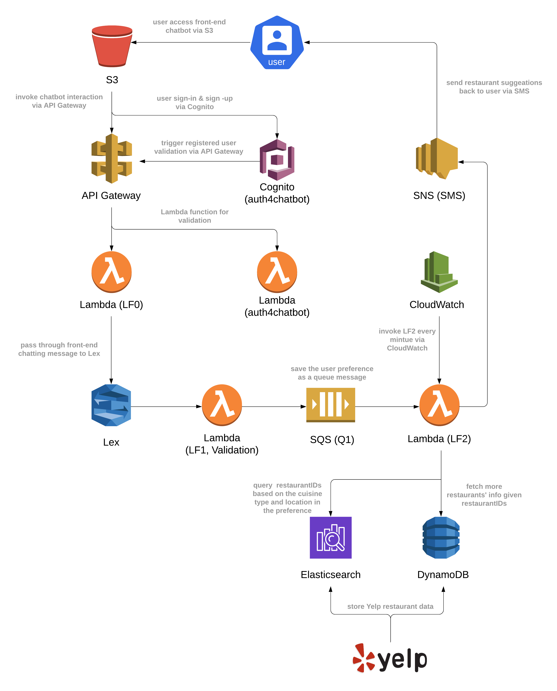

# Dining Concierge Chatbot

Customer Service is a core service for a lot of businesses around the world and it is getting greatly enhanced by Natural Language Processing-powered applications nowadays. This project implements a serverless, microservice-driven web application, specifically, a Dining Concierge Chatbot that sends the user some restaurant suggestions given a set of preference that the user provided through conversation with the chatbot.

## Workflow
A workflow demo video for this project: https://www.youtube.com/watch?v=nADHtbxYYXw

Every time the user accesses the chatbot web application, she would be asked to log in first and led to the sign-in/sign-up UI page hosted by AWS Cognito. After successfully logged-in or registered (and underneather token validation), then could she start the interction with the chatbot. Based on the conversation with the user, Lex chatbot will identify the user's preference (including cuisine type, location, date, time, phone number) and store it as an SQS queue message. Then, the Lambda fcuntion searches through Elasticsearch to get random suggestions of restaurantIDs with the given cuisine type and location. Meanwhile, the Lambda function would also fetch the restaurants' detailed info from the DynamoDB table (e.g., restaurant name, address, rating and price) for the given restaurantIDs. Finally, a restaurant-suggestion message will be sent back to the user's mobile via SMS.

||
|:--:|
|Application Architecture and Workflow|

## Implementation Details
### Build and deploy the front-end interface
1. Host the `S3` front-end file in an AWS S3 bucket.
2. Set the bucket up for website hosting and public accessing.

### Set up Cognito authentication
1. Create a user pool Auth4Chatbot.
2. Follow the tutorial [here](https://www.youtube.com/watch?v=BN3SBeqaq0g) to setup the configuration.
3. Create a Lambda function (auth4chatbot) to validate the id_token returned by Cognito.

### Build the API for the application
- API for the user authentication
   1. Create a post request API that linked to LF auth4chatbot.
   2. Enable CORS for the API methods.
   3. Deploy the API.
- API for the chatbot interaction
   1. Use the `API_Gateway-swagger.yaml` API/Swagger specification for the chatbot API.
   2. Create a Lambda function (LF0)​ that performs the chat operation and link to the chatbot API.
   3. Enable CORS for the API methods.
   4. Deploy the API.
   5. ​Generate an SDK for the API and replace the file inside S3/assets/js/sdk.

### Build a Dining Concierge Chatbot using Lex
1. Create a new bot using the Lex service.
2. Create a Lambda function (LF1) and use it as a code hook for Lex, which essentially entails the invocation of the Lambda before Lex responds to any requests.
3. Three bot intents: 
   1. GreetingIntent: When the chatbot receive a request for the GreetingIntent, it should compose a response such as “Hi there, how can I help?”.
   2. DiningSuggestionsIntent: Collect the following user preference/slots through the conversation: Location, Cuisine, NumberofPeople, DiningDate, DiningTime, PhoneNumber.
   3. ThankYouIntent: Lead the user to end the conversation.
4. Create the Lambda function (LF Validation) for the slot value validation (Location and PhoneNumber).
5. Based on the parameters collected from the user, push the information collected from the user (location, cuisine, etc.) to an SQS queue (Q1).

### Integrate the Lex chatbot into the chat API
- Use the AWS SDK to call the Lex chatbot from the API Lambda (LF0).
- When the API receives a request:
    1. Extract the text message from the API request.
    2. Send it to the Lex chatbot.
    3. Wait for the response.
    4. Send back the response from Lex as the API response.

### Use the Yelp API to collect 5,000+ random restaurants on Manhattan
- Restaurant data scrapping using Yelp API
    1. Search restaurants on Manhatta, New York given a specific cuisine type.
    2. Clean up any duplicate restaurant. 
- Store restaurant info in a DynamoDB table:
    1. Create a DynamoDB table and named "yelp-restaurants".
    2. Store the restaurants scraped in the DynamoDB table.
    3. Store necessary attributes: Business ID, Name, Address, Location, Number of Reviews, Rating, Zip Code

### Create an Elasticsearch instance
1. Create an Elasticsearch index called "restaurants".
2. Create an Elasticsearch type under the index "restaurants" called "Restaurant".
3. Store partial information (RestaurantID, Cuisine, Location/Region) for each restaurant scraped under the "restaurants" index.

### Build a suggestions module (decoupled from the Lex chatbot)
- Create a new Lambda function (LF2) that acts as a queue worker. Whenever it is invoked it:
    1. Pulls a message from the SQS queue (Q1).
    2. Gets a random restaurant recommendation for the cuisine type and locaiton/region the user prefered from Elasticsearch and DynamoDB.
    3. Sends it over text message to the phone number included in the SQS message, using SNS.
- Set up a CloudWatch event trigger that runs every minute and invokes the Lambda function (LF2).


## Directory Tree and Contents

**All personal AWS account & API key information in the following files has been desensitized.**

```
.
├── API_Gateway-swagger.yaml : configuration for API Gateway (linked to LF0)
├── S3 : Front-end static content deployed on S3
│   ├── README.md
│   ├── assets
│   └── chat.html
├── LambdaFunction0.py : LF0 that performs the chat operation
├── LambdaFunction1.py : LF1 that works as the code hook for Lex and sends users preference to SQS Q1
├── LambdaFunctionValidation.py : Lambda function for Lex slots validation
├── yelp_api_search.py : calling Yelp API to retrive restaurants on Manhattan given different cuisine types
├── restaurant_info.csv : restaurant info returned from the programming above
├── remove_duplication.py : remove duplicate restaurant info in the file above (uniqueness: restaurant_id)
├── restaurant_info_clean.csv : unique restaurant info returned from the programming above
├── dynamodb_data_upload.py : upload restaurant info above to the table in DynamoDB
├── csv2json.py : convert restaurant info CSV file to JSON format to better accommodate Elasticsearch
├── restaurant_info_clean.json : restaurant info that uploaded to Elasticsearch
├── elasticsearch_data_upload.txt : CLI script for uploading JSON to Elasticsearch
├── LambdaFunction2 : LF2 that acts as a queue worker
│   ├── bin
│   .
│   .
│   ├── urllib3
│   ├── chardet
│   ├── requests
│   ├── elasticsearch
│   └──lambda_function.py
└── LambdaFunction-auth4chatbot : Lambda function that validates JWT id_token returned from Cognito for authentication
    ├── bin
    .
    .
    ├── jose
    └── lambda_function.py
```